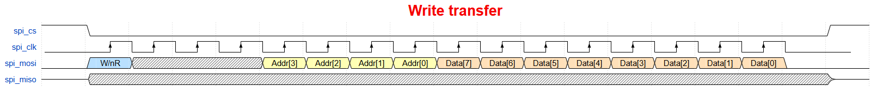
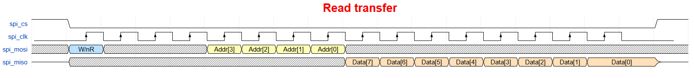
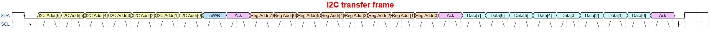

<!---

This file is used to generate your project datasheet. Please fill in the information below and delete any unused
sections.

You can also include images in this folder and reference them in the markdown. Each image must be less than
512 kb in size, and the combined size of all images must be less than 1 MB.
-->

## How it works

Register bank accessible throught two different serial interfaces: SPI and I2C. Use digital input to select prefered interface.

Digital input ui_in[7] = 0 selects SPI and ui_in[7] = 1 selects I2C.

## Block diagram
```sh                
                +----------------------------------------+
                |                                        |
                |   +-----------+        +-----------+   |
SPI Pins <----> |   | SPI Slave |        | I2C Slave |   | <----> I2C Pins
                |   | Interface |        | Interface |   |
                |   +-----+-----+        +-----+-----+   |
                |         ^                    ^         |
                |         |                    |         |
                |         |                    |         |
                |         v                    v         |
                |      +--+--------------------+--+      |
                |      |        Bus Arbiter       |      |
                |      +-------------+------------+      |
                |                    ^                   |
                |                    |  Internal         |
                |                    |  Register         |
                |                    |  Access Bus       |
                |                    v                   |
                |      +-------------+------------+      |
                |      |       Register Bank      |      |
                |      |                          |      |
                |      |   +------------------+   |      |
                |      |   |       REG0       |---|------|------> 7 segments display
                |      |   +------------------+   |      |
                |      |                          |      |
                |      |   +------------------+   |      |
                |      |   |       REG1       |   |      |
                |      |   +------------------+   |      |
                |      |            ...           |      |
                |      |   +------------------+   |      |
                |      |   |       REG14      |   |      |
                |      |   +------------------+   |      |
                |      |                          |      |
                |      |   +------------------+   |      |
                |      |   |       REG15      |   |      |
                |      |   +------------------+   |      |
                |      +--------------------------+      |
                |                                        |
                +----------------------------------------+
```

There are 8 read/write 8 bit registers and 8 read only 8 bit registers.

Address 0 (first byte in read/write register space) drives the 7 segment display.

SPI peripheral design based on https://github.com/calonso88/tt07_alu_74181

See that design's docs for information about the SPI peripheral.

Small improvement done on the spi_peripheral module. There used to be two buffer counters (one for RX and one for TX).
Since the counters are not used together, it was possible to remove one of them and use a single buffer counter.
This has reduced 4 flip flops in total and some combinatorial logic as well.

Added logic to control driver for MISO. On previous submissions of this design, the MISO was always driven.
Logic has been added to put MISO into high impedance when CS_N is driven high. Due to a 2-stage synchronizer, the MISO goes to high impedance after 2 clock cycles.

I2C peripheral design based on https://github.com/sanojn/tt06_ttrpg_dice

See that design's docs for information about the I2C peripheral.


## Protocol specification

### SPI Write (CPOL = 0, CPHA = 0)



### SPI Read (CPOL = 0, CPHA = 0)



### I2C Frame




## Register Map

| Offset | Name             | Access | Reset | Description                                        |
| -----: | ---------------- | :----: | :---: | -------------------------------------------------- |
|   0x00 | REG0             |   R/W  |  0x00 | Controls 7 segmets display on demoboard            |
|   0x01 | REG1             |   R/W  |  0x00 | General prupose register                           |
|   0x02 | REG2             |   R/W  |  0x00 | General prupose register                           |
|   0x03 | REG3             |   R/W  |  0x00 | General prupose register                           |
|   0x04 | REG4             |   R/W  |  0x00 | General prupose register                           |
|   0x05 | REG5             |   R/W  |  0x00 | General prupose register                           |
|   0x06 | REG6             |   R/W  |  0x00 | General prupose register                           |
|   0x07 | REG7             |   R/W  |  0x00 | General prupose register                           |
|   0x08 | REG8             |   RO   |  0xC4 | Constant ID Code 1                                 |
|   0x09 | REG9             |   RO   |  0x10 | Constant ID Code 2                                 |
|   0x0A | REG10            |   RO   |  0xAA | Constant ID Code 3                                 |
|   0x0B | REG11            |   RO   |  0x55 | Constant ID Code 4                                 |
|   0x0C | REG12            |   RO   |  0xFF | Constant ID Code 5                                 |
|   0x0D | REG13            |   RO   |  0x00 | Constant ID Code 6                                 |
|   0x0E | REG14            |   RO   |  0xA5 | Constant ID Code 7                                 |
|   0x0F | REG15            |   RO   |  0x5A | Constant ID Code 8                                 |


## How to test

### SPI
Use SPI1 Master peripheral in RP2040 to start communication on SPI interface towards this design. Remember to configure the SPI mode using digital inputs [0] and [1] to high (if you'd like to have CPOL=1 and CPHA=1).

Example code to initialize SPI in REPL:
```txt
spi_miso = tt.pins.pin_uio3
spi_cs = tt.pins.pin_uio4
spi_clk = tt.pins.pin_uio5
spi_mosi = tt.pins.pin_uio6
spi_miso.init(spi_miso.IN, spi_miso.PULL_DOWN)
spi_cs.init(spi_cs.OUT)
spi_clk.init(spi_clk.OUT)
spi_mosi.init(spi_mosi.OUT)
spi = machine.SoftSPI(baudrate=10000, polarity=0, phase=0, bits=8, firstbit=machine.SPI.MSB, sck=spi_clk, mosi=spi_mosi, miso=spi_miso)
spi_cs(1)
```

Example code to write 0xF8 to address[0]:
```txt
spi_cs(0); spi.write(b'\x80\xF8'); spi_cs(1)
```

This should set the 7 segment LED to 0xF8 which will display "t."

Seg A - OFF, Seg B - OFF, Seg C - OFF, Seg D - ON, Seg E - ON, Seg F - ON, Seg G - ON, Seg DP - ON

Example code to read from address[0]:
```txt
spi_cs(0); spi.write(b'\x00'); spi.read(1); spi_cs(1)
```

The result should be 0xF8 or whatever you wrote to address[0].


## I2C
Use I2C Master peripheral in RP2040 to start communication on I2C interface towards this design. Remember to configure the I2C address bits using the digital inputs [2], [3] and [4].

Example code to initialize I2C in REPL:
```txt
TO DO
```

Example code to write 0xF8 to address[0]:
```txt
TO DO
```

Example code to read from address[0]:
```txt
TO DO
```


## External hardware

You may need to use a pull up resistors on the i2c data and i2c scl lines if not possible to configured internally on the RP2040. To be checked at a later point in time.
Write to the first register to set the LEDs on the demoboard.
